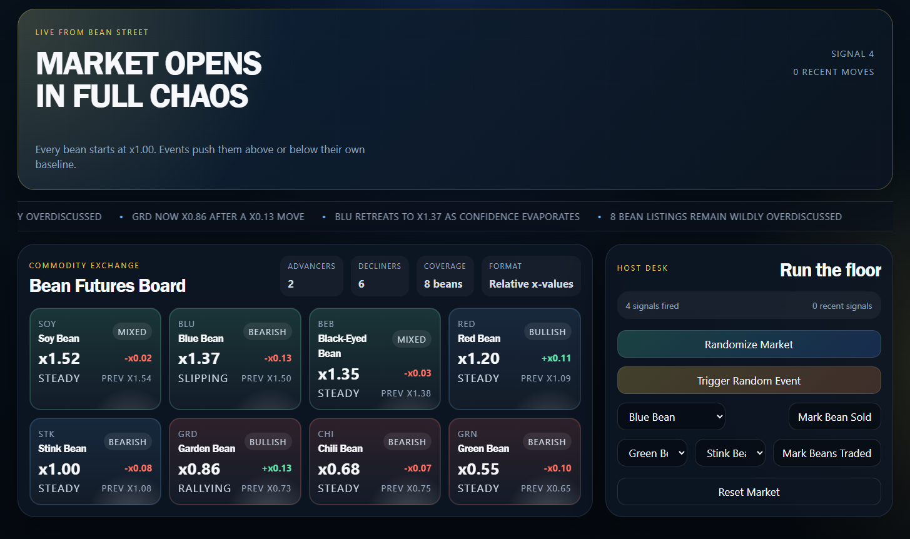

# Bean Street

Bean Street is a commodity exchange where beans are treated with the seriousness of a financial crisis.

This companion web-app is designed to be used alongside the [Bohnanza card game](https://boardgamegeek.com/boardgame/11/bohnanza).

One host runs the floor while bean listings swing between glory and disaster. Headlines flare up, the ticker keeps talking, and every tiny move is presented like a market-shaking event.

It is a small host-driven market board built for quick rounds, demos, and general bean-related overreaction. The host can trigger random events, force selloffs, pair beans in trades, and reset the market, with the board instantly updating its rankings, momentum, sentiment, headline copy, and ticker chatter.

For contributor notes, repo structure, and development workflow, see `docs/DEVELOPMENT.md`. For running the app live as the operator, see `docs/HOST.md`.

